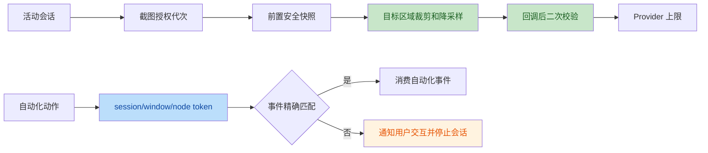

# Round 10 代码与安全评审

评审日期：2026-07-19

## 结论

- 代码评审：未发现阻断提交的正确性问题。
- 安全评审：未发现可利用的 source-to-sink 漏洞链。
- 验证结论：截图闭环通过；API 34 严格事件归因通过；API 30-33 设备验证待完成。

## 变更意图

1. 消除截图完成后的授权、前台包和敏感语义竞态。
2. 在设备本地最小化截图，不使用 Provider `detail=low` 替代裁剪与降采样。
3. 使用 session/window/node/action token 区分自动化事件与用户语义交互。
4. 移除会改变目标 OPPO 设备正常触控行为的 raw touchscreen observer。

## 审查证据

| 范围 | 结果 |
| --- | --- |
| 截图授权 | 授权绑定活动会话 ID，同包新会话不能复用旧授权 |
| 截图竞态 | 回调后重新校验授权、目标包和敏感语义，失败立即清零 |
| 图像最小化 | 裁剪目标根区域，长边不超过 1280 px，PNG 不超过 900 KiB |
| 事件归因 | 匹配 session、window、node identity、event type、event time 和预算 |
| 歧义处理 | 坐标手势无法命中唯一语义节点时拒绝执行 |
| 触控语义 | 不启用 touch exploration、raw motion flag 或 motion sources |
| 发布隔离 | 设备自检宿主只存在于 debug source set，release APK 构建通过 |

## 实际验证

| 命令或探针 | 结果 |
| --- | --- |
| `make test` | 通过 |
| `make verify` | 通过 |
| `make build` | 通过 |
| `go test -race ./...` | 通过 |
| Android `testDebugUnitTest` | 183 个测试通过，0 failure/error/skip |
| Android `lintDebug` | 0 issue |
| `assembleDebug` / `assembleDebugAndroidTest` / `assembleRelease` | 全部通过 |
| API 34 `connectedDebugAndroidTest` | 3 个录制 UI 测试通过；2 个手动无障碍测试按设计跳过；0 failure/error |
| API 34 真机截图 | `SCREENSHOT_PASS` |
| API 34 自动化归因 | `AUTOMATION_CLICK_PASS` |
| API 34 用户手指交互 | `USER_TOUCH_PASS` |

## 残余边界

- API 30-33 尚无对应设备或模拟器，因此 Task 21/23 继续未完成。
- 空白区域且不产生 View accessibility event 的触摸无法在不改变普通触控语义的
  前提下可靠观测。
- 目标 OPPO 在 APK 更新后撤销无障碍授权；测试不自动写入 `Settings.Secure`，
  也不绕过用户授权。
